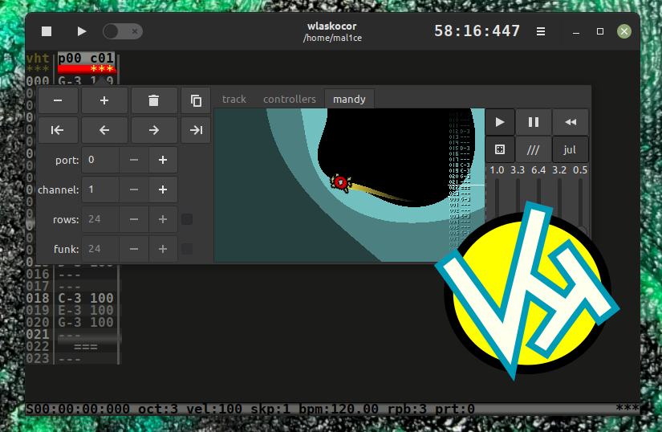

## about
vahatraker is a MIDI sequencing companion
for GNU/Linux audio setups. Adhering to Unix philosophy,
driving MIDI is the one thing it tries to do well,
adhering to other doctrines - enabling expression,
with added value of:

- live editing
- fast workflow
- intuitive midi-in
- unheard of time signatures
- scenes
- fractal turtles
- fits on a floppy
- doesn't make a sound

Frankly speaking, vht was envisaged as a re-creation
of seq24 in tracker form for author's "studio needs"
and offers similar functionality (and limitations).
It relies 100% on JACK audio connection kit for 
input/output/synch and uses jack_capture for rendering.
The GUI has similar dependencies as gnome-calculator
and tracker paradigm was chosen to allow for rhythmic
gymnastics otherwise hard to convey.

Low level stuff was done in C and wrapped in Python.
Human interfacing part of contraption employs
GTK through gobject introspection and was also contrived
in the language we shall no longer spam about.

## dependencies for pip build
```
pipewire-audio-client-libraries [jack_capture]
```
## install
```
pip3 install vht
```
